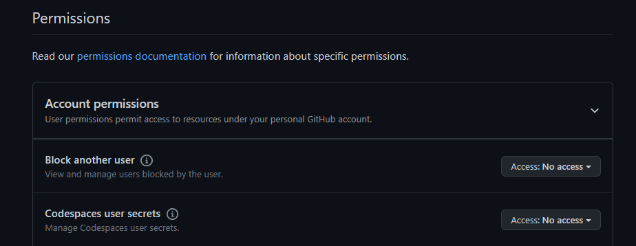

---toml
tags = ['deno','github','api','typescript']
---
There's several ways of creating a blog nowadays, whether it is with a legacy CMS such as [Wordpress](https://wordpress.com) whether it is by taking a more modern approach using a headless CMS solution like [Strapi](https://strapi.io) or even building it with [Astro](https://astro.build) through their brand new feature [Content Collections](https://docs.astro.build/en/guides/content-collections/).

Bref, there're plenty of solutions.

## Why not build it ourselves ?
I know right, I had the same idea 🤓

I wanted a solution that would be CMS-like, with automatic time tracking of blog post creation/edition possibility of several authors and easy content management.

When describing like this, it does sound familliar right ? <br>
*Excatly*, I'm basically describing **Git** and **Github**.

So, now that's it's clearer in our head let's summarize what we are going to do :
- Use the Github API
- Use a dedicated repo to store our blog posts
- Use Deno + Fresh
- Implements type safety

## The Github part 
First thing first when it comes to external API, let's grab ourselves a key to authenticate our requests, for github you'll be able to generate one [here](https://github.com/settings/tokens?type=beta).
 You can refine the token accesses or just checking every permissions it's up to you. 

Then let's create a new repo, I simply named it `blog`. Create a basic `.md` file and we are good for now.

## The code part
> I'll let you refer to the [official Fresh doc](https://fresh.deno.dev/docs/getting-started/create-a-project) to create a new project and grabbing the basics understanding of this framework as it's beyond the scope of this article.

After, creating a new project with this command
```bash
$ deno run -A -r https://fresh.deno.dev github-blog
```
We're left with this folder structure
```bash
.
├── README.md
├── components/
├── deno.json
├── deno.lock
├── dev.ts
├── fresh.gen.ts
├── import_map.json
├── islands/
├── main.ts
├── routes/
│   └── index.tsx
├── static
│   └── favicon.ico
└── twind.config.ts
```

To start off, let's create a new folder `utils` at the root directory of our project and create a new file that will hold the logics of fetching our blogposts, I came with the funny name of `octoblog.ts`.

First thing we are gonna do is to create the `Headers` object that we'll reuse for all our requests. We need it to of course authenticate our requests.
```typescript
const headers = new Headers();
headers.append('Authorization', `token <TOKEN>`);
headers.append('Accept','application/vnd.github+json');
```
That probably won't be a good idea to inline your private access token right here in the code, rather add it to you env variable and access it through `Deno.env.get(key: string)`.

Then let's create a fetch wrapper so that it's all safely typed.
> Remember, all of this is executed on server side in fresh
```ts
export class Octoblog {
  private static get<T extends Endpoint>(endpoint: T): Promise<ResponseType<T>> {
    const data = await fetch(endpoint, {
      headers, method: 'GET'
    });
    return await data.json();
  }
}
```

Ok, the idea here is simple : we will define the `Endpoint` type and based on which endpoints we queried, we will receive a proper `ResponseType`.

We will need to hit 3 different endpoints for this : 
/contents
: k
`/commits`
:
`/git/trees`
:


